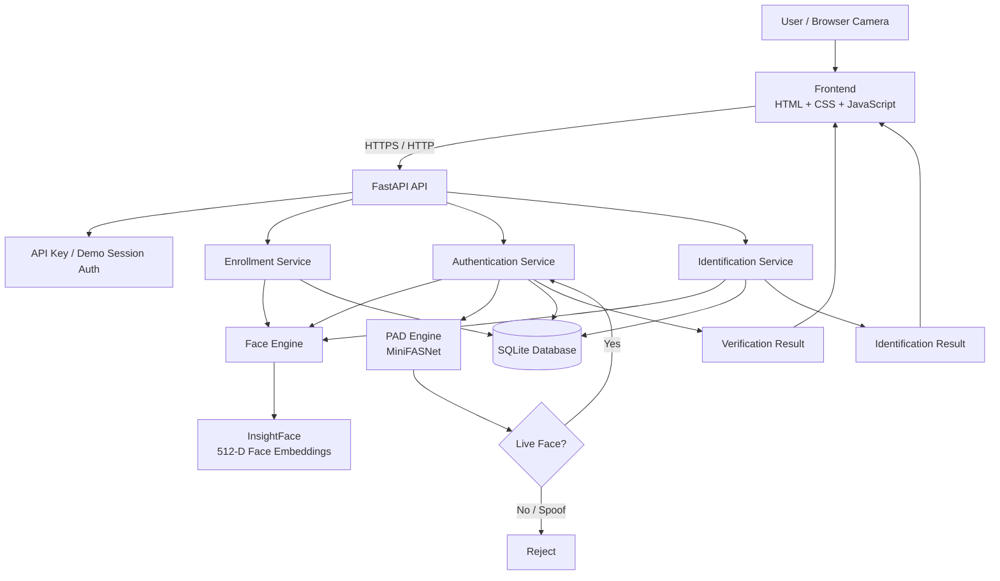

# AI-Powered Face Authentication Platform

An AI-based face authentication platform built with **FastAPI, InsightFace, MiniFASNet PAD, OpenCV, and SQLite**.

The system supports **face enrollment, 1:1 face verification, and 1:N face identification**, with Presentation Attack Detection (PAD) to help detect spoofing attempts.

> **Status:** Development / demonstration project. Biometric thresholds and security controls are not yet calibrated or validated for production use.

## ✨ Features

- 📷 Browser-based camera capture
- 👤 Multi-sample face enrollment
- 🔐 Face verification (1:1)
- 🔎 Face identification (1:N)
- 🛡️ Presentation Attack Detection (PAD)
- 🧠 InsightFace face embeddings
- ⚡ FastAPI REST API
- 🗄️ SQLite template storage
- 🌐 Same-origin frontend served by FastAPI
- 🔑 Server-side API-key authentication
- 🍪 HttpOnly demo session for the public demonstration
- 🐳 Docker deployment configuration
- ☁️ Render deployment configuration

## 🏗️ System Architecture



## 🔄 Authentication Pipeline

```text
Camera
  │
  ▼
Capture Face Image
  │
  ▼
Face Detection
  │
  ▼
Presentation Attack Detection (PAD)
  │
  ├── Spoof detected ──► Reject
  │
  └── Live face
          │
          ▼
   Face Embedding
   (InsightFace)
          │
          ▼
   Compare Embeddings
          │
     ┌────┴────┐
     ▼         ▼
  Verify    Identify
   1:1        1:N
     │         │
     └────┬────┘
          ▼
    Authentication
       Result
```

## 🧩 Project Structure

```text
ai-powered-face-authentication/
│
├── api/
│   ├── main.py                 # FastAPI application and API routes
│   └── security.py             # API-key / session authentication
│
├── app/
│   ├── face_engine.py          # InsightFace detection + embeddings
│   ├── pad_engine.py           # MiniFASNet anti-spoofing
│   ├── enrollment.py           # Face enrollment logic
│   ├── verification.py         # Face verification
│   ├── camera_enrollment.py    # Camera enrollment workflow
│   ├── camera_identification.py
│   └── camera_session.py
│
├── services/
│   ├── authentication_service.py
│   └── identification_service.py
│
├── storage/
│   └── database.py             # SQLite persistence
│
├── frontend/
│   ├── index.html
│   ├── app.js
│   └── style.css
│
├── models/
│   └── minifasnet/             # PAD model and supporting files
│
├── admin/
│
├── Dockerfile
├── render.yaml
├── requirements.txt
├── .env.example
├── DEPLOYMENT.md
└── README.md
```

## 🔐 Authentication Modes

### API clients

API clients can authenticate using the `X-API-Key` header.

```http
X-API-Key: <server-side-api-key>
```

The API key must **never** be placed in browser JavaScript or committed to GitHub.

### Browser demonstration

The hosted demonstration can use an HttpOnly session cookie. This keeps the API secret out of frontend JavaScript.

The current public demo mode is intended only for demonstration and testing, **not as a real customer login system**.

## 🧠 Core AI Components

### Face Engine

The face engine uses **InsightFace** to:

1. Detect a face.
2. Extract facial features.
3. Generate a normalized 512-dimensional face embedding.
4. Compare embeddings using cosine similarity.

### Presentation Attack Detection

The PAD layer uses **MiniFASNet** models to help distinguish live faces from presentation attacks such as photographs or screen replays.

The PAD implementation is based on the included MiniFASNet project and its accompanying license.

## 🔎 Verification vs Identification

### Verification — 1:1

Answers:

> "Is this person the claimed user?"

Example:

```text
User claims: Rithvik
        ↓
Camera face
        ↓
Compare against Rithvik's templates
        ↓
Match / No Match
```

### Identification — 1:N

Answers:

> "Which enrolled user is this?"

Example:

```text
Camera face
    ↓
Compare against active users
    ↓
User A
User B
User C
...
    ↓
Best matching identity
```

## 🗄️ Data Storage

The current implementation stores:

- Customer ID
- External user ID
- Active/inactive status
- Face embeddings
- Embedding dimensions
- Creation timestamps

SQLite is currently used for the prototype.

For a production multi-instance deployment, the database layer should be migrated to a managed database such as PostgreSQL and biometric retention/deletion policies should be implemented.

## 🚀 Run Locally

The repository now includes a reproducible local setup so a fresh clone does **not** require manually exporting the authentication variables.

### 1. Clone

```bash
git clone https://github.com/rithvikchandrashekhar-dotcom/ai-powered-face-authentication.git
cd ai-powered-face-authentication
```

### 2. Run the one-time setup

```bash
bash setup.sh
```

This will:

- Create the Python virtual environment in `venv/`.
- Install all dependencies from `requirements.txt`.
- Generate a new local `FACE_AUTH_API_KEY`.
- Create a local `.env` with browser-demo settings.
- Create the local `database/` directory.

The generated `.env` is ignored by Git, so the local API key is **never committed to the repository**.

### 3. Start the backend

Open **Terminal 1**:

```bash
bash run_backend.sh
```

The backend will run at:

```text
http://127.0.0.1:8000
```

FastAPI docs:

```text
http://127.0.0.1:8000/docs
```

The backend script automatically loads `.env`, including `PUBLIC_DEMO_MODE=true` and the generated API key. This prevents the local browser demo from hitting the previous `401` authentication problem.

### 4. Start the frontend

Open **Terminal 2**:

```bash
bash run_frontend.sh
```

Then open:

```text
http://localhost:5500
```

### 5. Important security rule

Never commit your real `.env` or API keys.

For local development, `setup.sh` generates a different API key on each machine. Production environments such as Render should continue to provide their own environment variables/secrets rather than using the local `.env`.

### Manual setup

If you prefer not to use the scripts, you can still configure the project manually:

```bash
python3 -m venv .venv
source .venv/bin/activate
pip install -r requirements.txt
cp .env.example .env
```

Then replace the placeholder `FACE_AUTH_API_KEY` in `.env` with a strong random secret and start FastAPI:

```bash
set -a
source .env
set +a
python -m uvicorn api.main:app --reload --host 127.0.0.1 --port 8000
```

## ☁️ Deployment

The repository includes:

- `Dockerfile`
- `render.yaml`
- `DEPLOYMENT.md`

The intended deployment architecture is:

```text
Browser
   │
   ▼
Render Web Service
   │
   ├── FastAPI
   ├── Frontend
   ├── InsightFace
   ├── MiniFASNet PAD
   └── SQLite / persistent storage
```

See [DEPLOYMENT.md](DEPLOYMENT.md) for deployment notes.

## ⚠️ Security & Production Notes

This project is a development/demo implementation.

Before production use, the following should be addressed:

- Replace demo session authentication with real customer/application authentication.
- Rotate any API secrets that were previously exposed.
- Add authorization and tenant isolation.
- Add rate limiting and abuse protection.
- Calibrate face-match thresholds on representative validation data.
- Calibrate PAD thresholds and evaluate attack presentation types.
- Establish biometric consent, retention, deletion, and access policies.
- Encrypt sensitive data at rest and in transit.
- Move from SQLite to a managed production database when scaling.
- Add monitoring, audit logging, and incident controls.
- Perform security and biometric performance testing.

## 📊 Current Pipeline Summary

| Layer | Technology | Purpose |
|---|---|---|
| Frontend | HTML / CSS / JavaScript | Camera UI and API interaction |
| API | FastAPI | REST API and request handling |
| Face Engine | InsightFace | Detection and embeddings |
| PAD | MiniFASNet | Presentation attack detection |
| Computer Vision | OpenCV | Image/video processing |
| Matching | Cosine similarity | Face template comparison |
| Storage | SQLite | User/template persistence |
| Deployment | Docker / Render | Cloud hosting |

## 📄 License

This repository contains third-party model code and assets. Refer to the included third-party project licenses, particularly the MiniFASNet project under `models/minifasnet/`.

---

**Built as an AI/Computer Vision engineering project for face authentication, verification, identification, and anti-spoofing research.**
